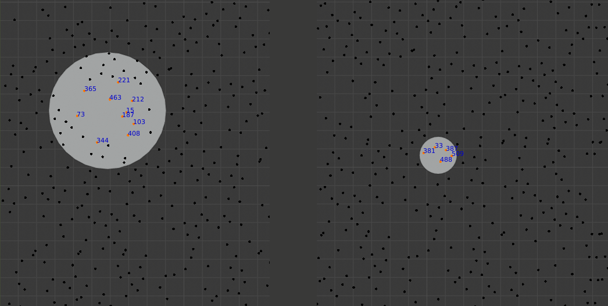

## KD-Tree
A C++ implementation of a KD-Tree with `k=2` and the datatype fixed to `float`.

Given the input of a maximum radius, a query size, a query point and a set of points, the script will do a 2D-search in the given points-set and print the nearest results.

### Build

    g++ main.cpp PtTree.cpp -o bin/PtTree

### Usage

Supply no arguments to display the help. 

    PtTree.exe

Valid arguments are

Param|Type|Value
-|-|-
Amount | Int | The maximum number of points which are searched for and returned.
Radius | Float | The maximum distance from the query point in which points can be found.
Query Point | Point | The query point.
Search Points | Points | The search points from which the tree is made of.

Points must be given as `xx.xx,yy.yy`(e.g. `12.4,0.423`) without spaces.

### Visual Verification

You can verify this results visually using Blender.  
The python script `bin/bpy_validation.py` can be executed in Blender 2.8. It requires

- an object and an attached mesh named `PointCloud`
- a circular mesh object named `Search`, which will be used to determine the query point and search radius

The resulting points will be highlighted in the 3D View and the stdout printed in the console.

