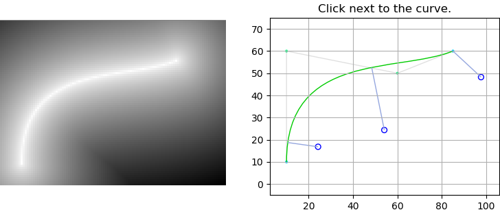

# Distance between a point and a Cubic Bezier Curve

This python script contains a class representing a cubic bezier curve.

The class showcases a method to find a point on the bezier curve which is closest to a given point. The script is referenced in [this answer](https://stackoverflow.com/a/57315396/6879283), for other methods, look at [this stackoverflow thread](https://stackoverflow.com/q/2742610/6879283).
The file also contains an example.



To run the example, install the following dependencies in Python 3.

```
python -m pip install numpy
python -m pip install matplotlib
python -m pip install opencv-python
```

Running the example opens an opencv window and a matplotlib graph. Click in the graph adds a point at the clicked location and the shortest line to the curve.