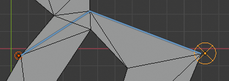

Pathfinding algorithms.

In games, usually a *Visibility Graph* is created, then A* is used.

Without a visibility graph, A* result can be post-smoothed to traverse across edges or faces. Theta* immediately tries to traverse edges, but does not always find the optimal paths.

### References

- [A+ by Nicolas Swift](https://medium.com/@nicholas.w.swift/easy-a-star-pathfinding-7e6689c7f7b2)
- [A* starting from the center of a face](https://medium.com/@mscansian/a-with-navigation-meshes-246fd9e72424)
- [Point in triangle test](http://blackpawn.com/texts/pointinpoly/default.html)
- [A* Pathfinding (E04: heap optimization)](https://www.youtube.com/watch?v=3Dw5d7PlcTM)
- [Understanding Goal-Based Vector Field Pathfinding](https://www.youtube.com/watch?v=Bspb9g9nTto)

This method *iota_star* prioritices finding the **shortest** path.

