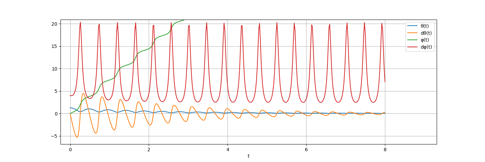
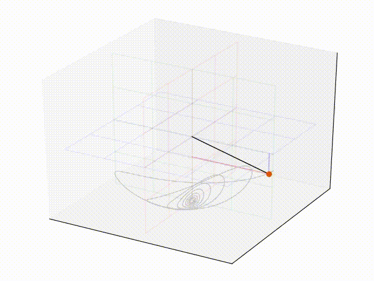

Simulate a spherical pendulum using a numerical integrator.

### References
[Spherical Pendulum](http://farside.ph.utexas.edu/teaching/336k/Newtonhtml/node82.html) describes how the equations of a spherical pendulum are derived. Starts with the dependencies between cartesian coordinates and the lagrangian coordinates $\theta$ and $\phi$.

[Case Of the Spherical Pendulum](http://physique.unice.fr/sem6/2011-2012/PagesWeb/PT/Pendule/En/study2_spherical.html) briefly derives the energies, lagrangian and movement equations and hosts a matlab example script.

[Python ODE solver (nathantypanski.com)](https://nathantypanski.com/blog/2014-08-23-ode-solver-py.html) describes how to solve a second-order ODE with NumPy and SciPy.